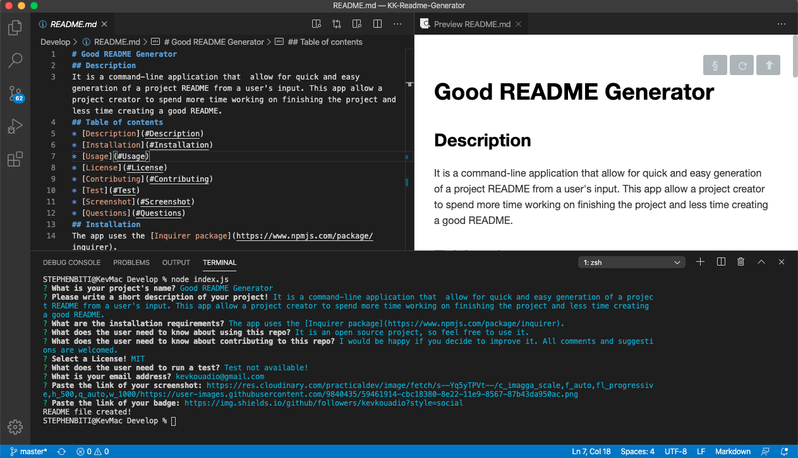

# Good README Generator

## Description
It is a command-line application that allow for quick and easy generation of a project README from a user's input. This app allow a project creator to spend more time working on finishing the project and less time creating a good README.
This readme was generated by the app.
## Table of contents
* [Description](#Description)
* [Installation](#Installation)
* [Usage](#Usage)
* [License](#License)
* [Contributing](#Contributing)
* [Test](#Test)
* [Screenshot](#Screenshot)
* [Questions](#Questions)
## Installation
The app uses the Inquirer package. To install it, run ‘npm i inquirer’.
## Usage
To use this app, run index.js, a series of prompts will be generated, answer each questions and press enter.
## Licence
This app is under the MIT License.
## Contributing
I would be happy if anyone decide to improve it. All comments and suggestions are welcomed.
## Test
Test not available!
## Screenshot
[Click here to see the demo Video](https://youtu.be/Swi2hdbs-es)

## Questions
Contact me: kevkouadio@gmail.com

My Github: http://github.com/kevkouadio